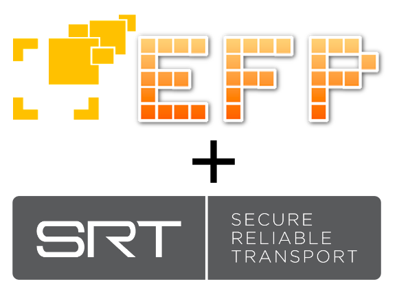
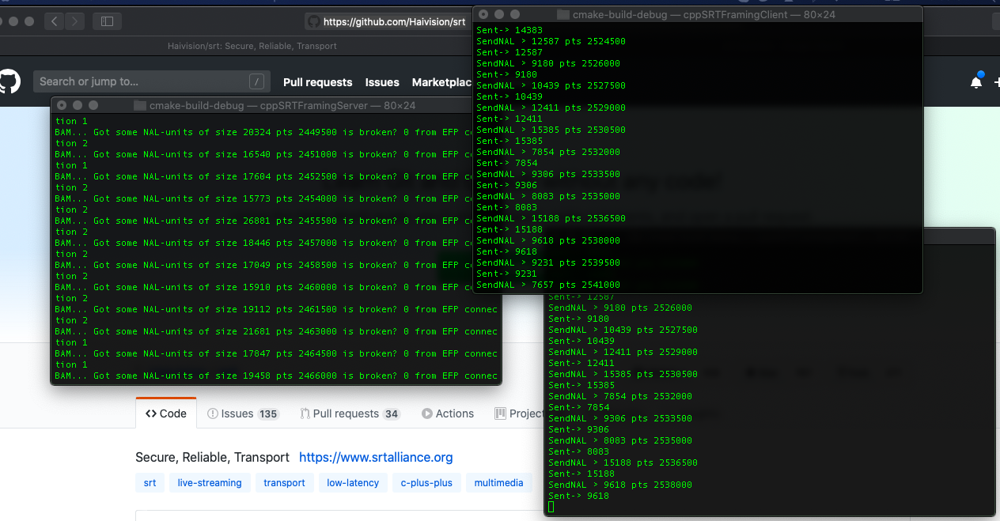

# SRT + EFP Client/Server example

This example uses EFP ([ElasticFramingProtocol](https://github.com/Unit-X/efp)) as a layer between the producer/consumer of data and the transport layer. As network protocol/transport layer SRT ([SecureReliableTransport](https://github.com/Haivision/srt)) is used.

a SRT C++ wrapper used by this example. The wrapper is located [here](https://github.com/andersc/cppSRTWrapper).

## build


Requires cmake version >= **3.10** and **C++17**

*Linux, MacOS and Windows*

(Read below for how to prepare the different systems)

**Release:**

```sh
mkdir build
cd build
cmake -DCMAKE_BUILD_TYPE=Release ..
cmake --build . --config Release
```

***Debug:***

```sh
mkdir build
cd build
cmake -DCMAKE_BUILD_TYPE=Debug ..
cmake --build . --config Debug
```

**Run the system:**

```
1. Start the server 
./cppSRTFramingServer
2. then from the other terminals.
./cppSRTFramingClient
```

Expected result->



The server prints out information about the data recieved. If the data is broken or not meaning data loss or not in the transport layer. Then as pictured two clients connected and the server prints from what client the data came from.

# Preparing Linux

```sh
sudo apt-get update
sudo apt-get upgrade
sudo apt-get install tclsh pkg-config cmake libssl-dev build-essential
```

# Preparing MacOS

Prepare your system by installing ->

* [Xcode](https://itunes.apple.com/us/app/xcode/id497799835)
. Then start Xcode and let xcode install Command Line Tools or run *xcode-select --install* from the terminal.

* **Homebrew** -> [[https://brew.sh](https://brew.sh))

* Then Install dependencies

```sh
brew install cmake
brew install openssl
export OPENSSL_ROOT_DIR=$(brew --prefix openssl)
export OPENSSL_LIB_DIR=$(brew --prefix openssl)"/lib"
export OPENSSL_INCLUDE_DIR=$(brew --prefix openssl)"/include"
```

# Preparing Windows


Prepare your system by installing->

* [Visual Studio](https://visualstudio.microsoft.com/downloads/)
(Also add the CMake build support if you plan to develop applications)

*  **chocolatey** -> [https://chocolatey.org](https://chocolatey.org)

* Then Install dependencies

```sh
choco install openssl
choco install cmake
choco install git
```


 